# Subflows in SAS Viya

## Exercise Description
In this hands-on workshop, you will create a flow to import and clean a table containing car data. Then, you'll use the flow as a subflow in an existing flow that joins and analyzes car data.

## Workshop Preparation

1. Confirm that the virtual lab opens on the **SAS Studio** *Start Page* in a Google Chrome window.

   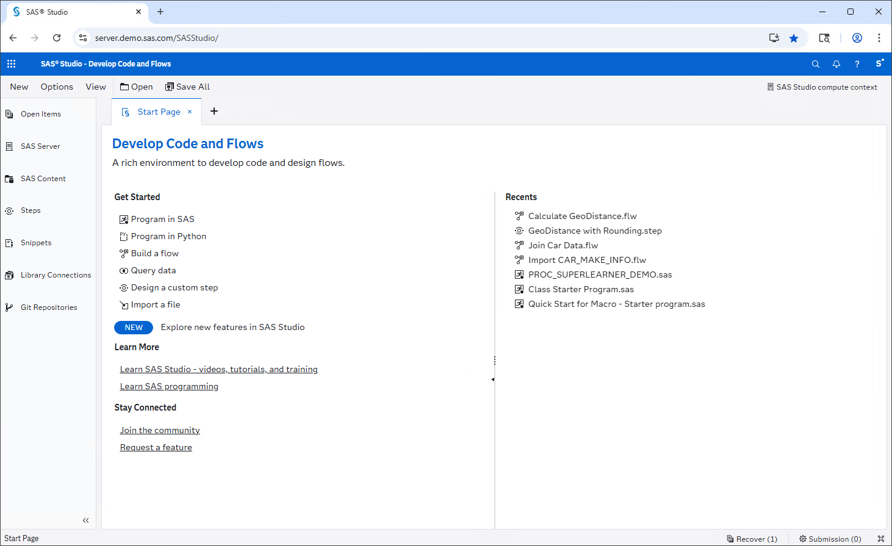

1. Open a new tab in the *Google Chrome* browser.
1. Select **Learning Labs &#10132; Subflows-in-SAS-Viya** to open the GitHub repository for the workshop.

   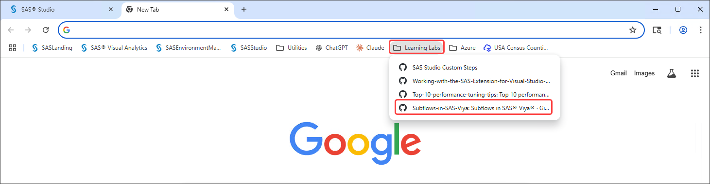

   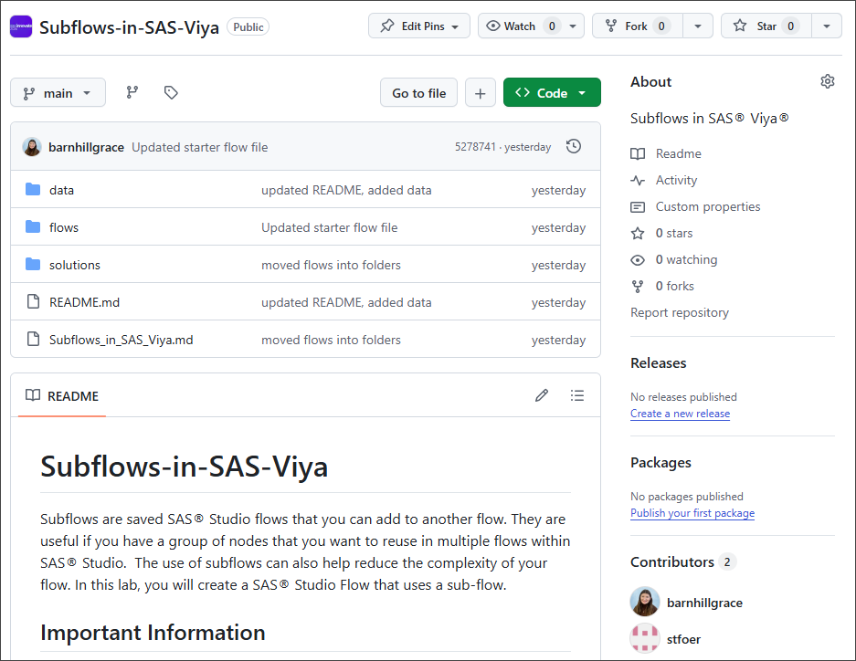

1. Select the **data** folder, then open **Car_Make_Info.csv**. Select  to download the CSV file.

   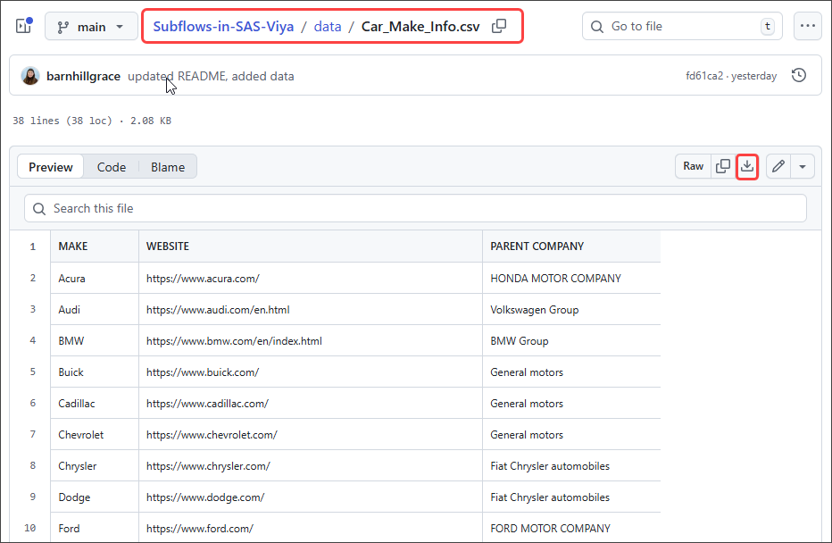

1. Return to the main repository folder.
1. Select the **flows** folder, then open **Join Car Data.flw**. Select  to download the flow file.

   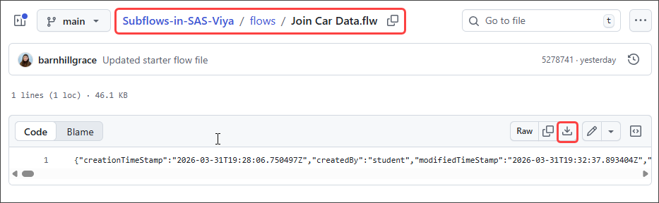

1. Return to the *SAS Studio* tab.
1. Select  to view the **SAS Content** pane.
1. Right-click **My Folder** and select **Upload files**.

   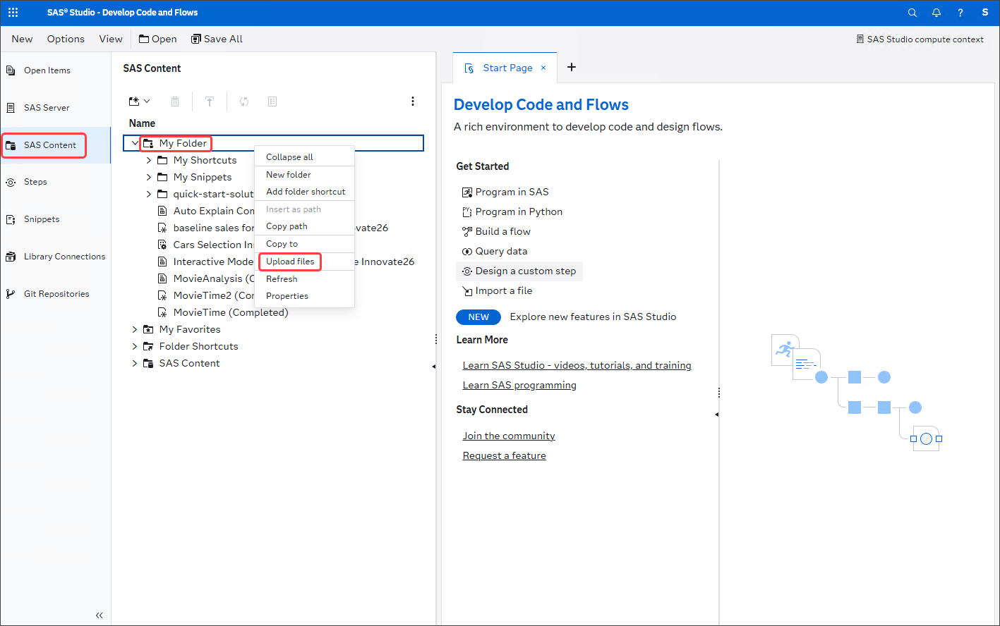

1. Select **+ Add files** in the *Upload Files* window.
1. In the File Explorer, navigate to the **Downloads** folder. Hold down the *Shift* key, then select **Join Car Data.flw** and **Car_Make_Info.csv**. Click **Open** to add the files to SAS Studio.

   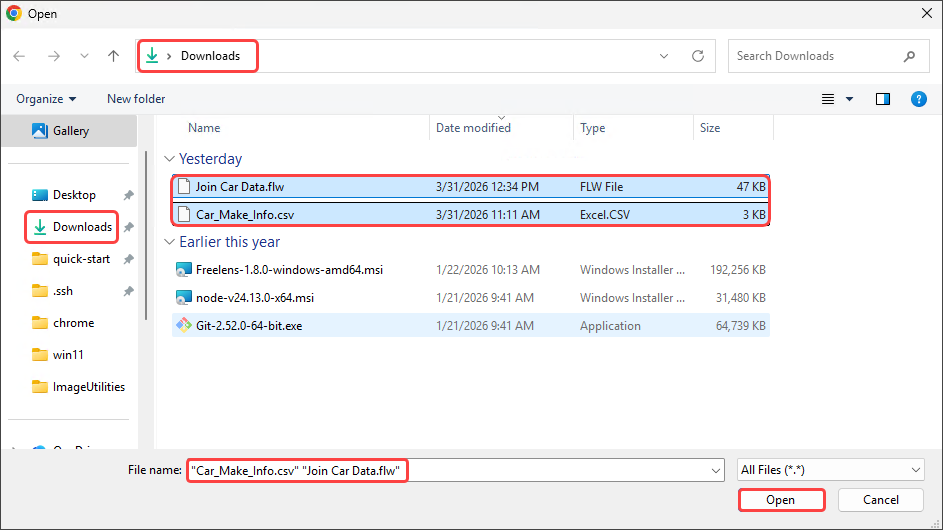

1. Keep the default selections for the file encoding, then click **Upload** to confirm the upload of all files to *My Folder*.

   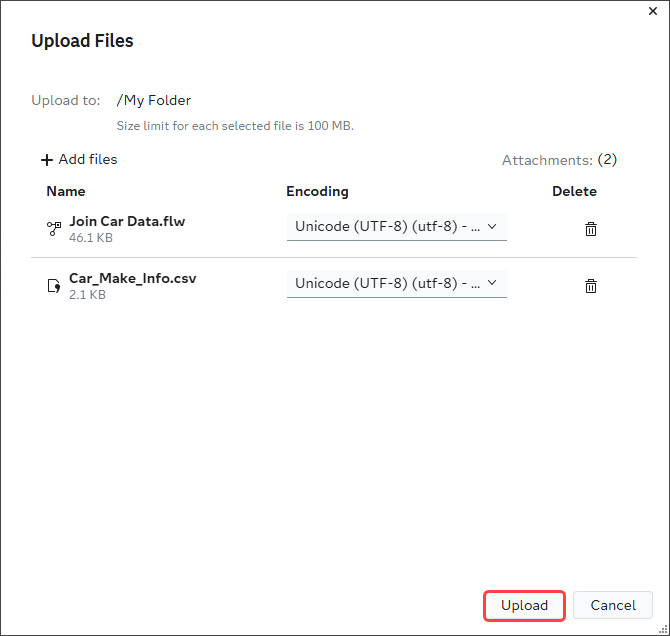

1. If necessary, select **My Folder** and click  to refresh the file list.

   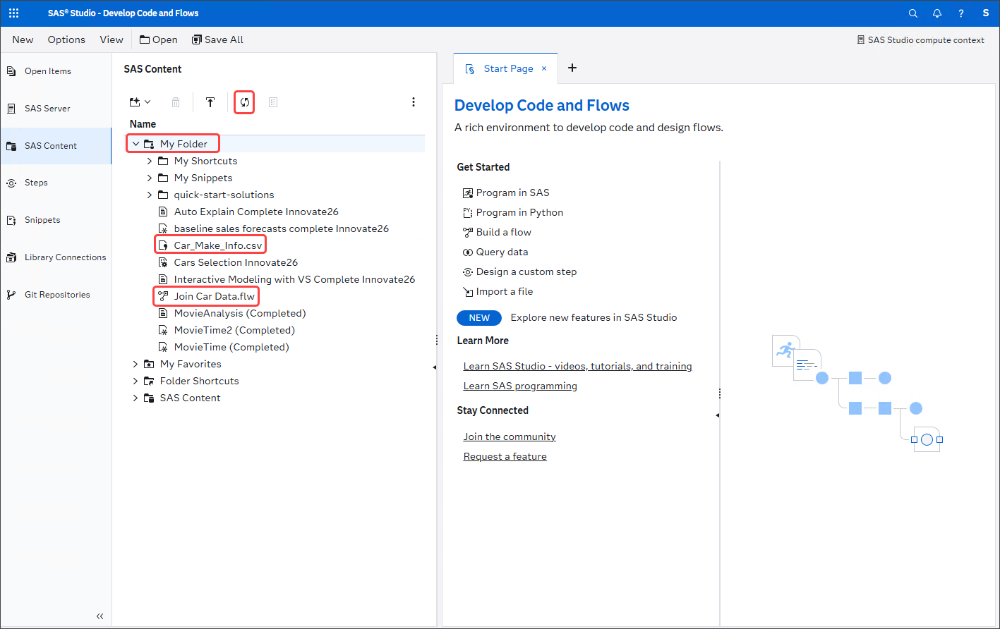

## Create Flow *Import CAR_MAKE_INFO.flw*

1. Select **New &#10132; Flow** to create a new flow.
1. Click and drag **Car_Make_Info.csv** onto the flow canvas. The file will automatically appear in an *Import File* node.

   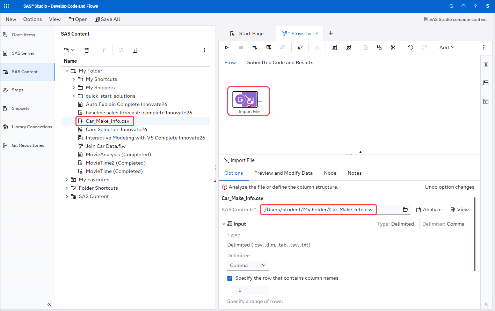

1. On the *Options* tab, click  to analyze the file contents.
1. Select *Preview and Modify Data* to view the file information. The imported file should have **3** columns and **37** rows.

   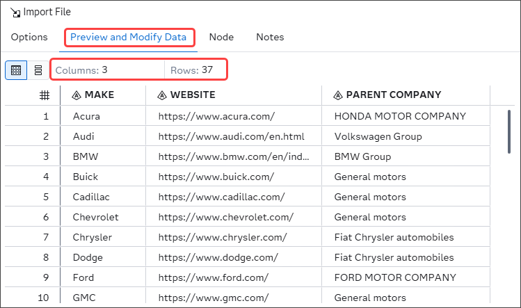

   > &#9998; Note that each **WEBSITE** URL starts with `https://` and that **PARENT COMPANY** values vary in casing.

1. Right-click the output port of the *Import File* node and select **Add a table** to add an output table to the node.
1. On the *Table Properties* tab, type the following:
   * Library: **WORK**
   * Table name: **CAR_MAKE**

   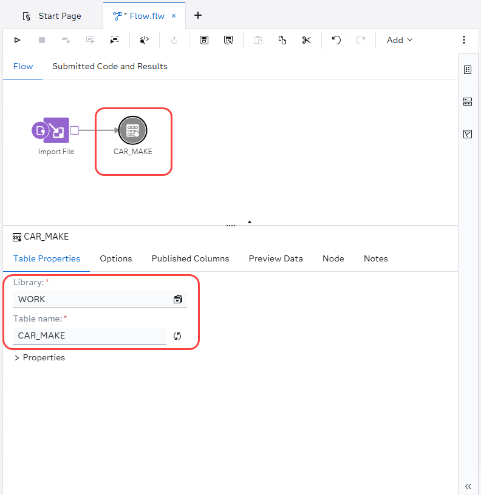

1. Select  to rearrange the nodes in the flow.

   > &#9998; You may have to collapse the **SAS Content** pane to view the *Arrange Nodes* option on the flow toolbar.

1. Select  to save the flow.
1. In the *Save As* window, Navigate to **SAS Content &#10132; My Folder**.
1. Enter **Import CAR_MAKE_INFO** for the file name and click **Save**.

   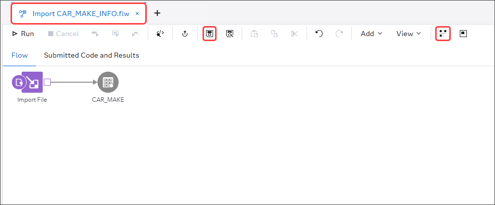

1. Select 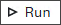 to run the flow. Review the **Submitted Code and Results** and confirm that **CAR_MAKE** was created with **3** columns and **37** rows.

   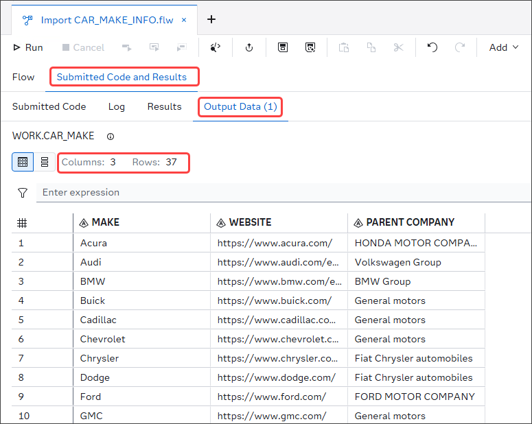

1. Select 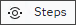 to view the **Steps** pane.
1. Expand *Data Quality*, then click and drag the **Clean Data** step onto the flow canvas. Draw an arrow to connect **CAR_MAKE** to the input port of **Clean Data**.

   > &#9998; To connect two nodes in a flow, click from the right edge (for data) or output port (for steps) of the first node, then drag to the left edge (for data) or input port (for steps) of the second node.

   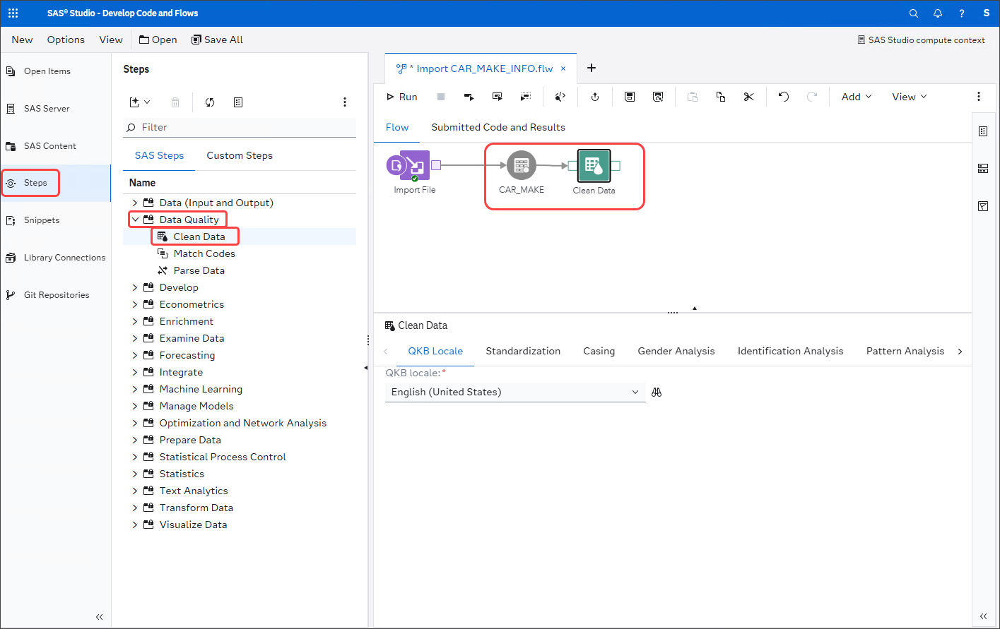

1. Keep the default QKB locale selection, **English (United States)**, on the *QKB Locale* tab.

   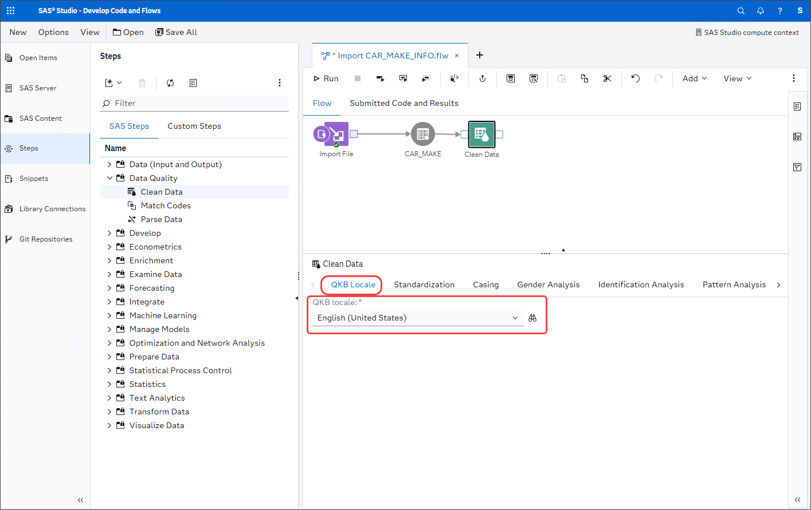

1. Select the *Standardization* tab, then check the box to **Enable standardization**. This will surface additional step options.
1. Configure standardization as follows:
   * Select column: **WEBSITE**
   * Definition: **Website**
   * Column options: **Replace existing column**

   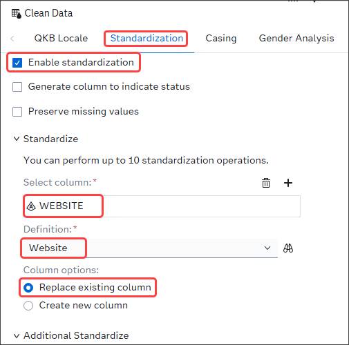

1. Select the *Casing* tab, then check the box to **Enable casing**. This will surface additional step options.
1. Configure casing as follows:
   * Select column: **PARENT COMPANY**
   * Definition: **Proper (Organization)**
   * Column options: **Replace existing column**

   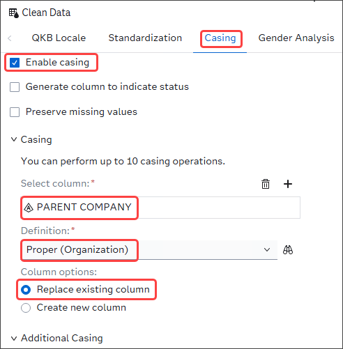

1. Right-click the output port of the *Clean Data* node and select **Add a table** to add an output table to the node.
1. On the *Table Properties* tab, type the following:
   * Library: **WORK**
   * Table name: **CAR_MAKE_CLEAN**

   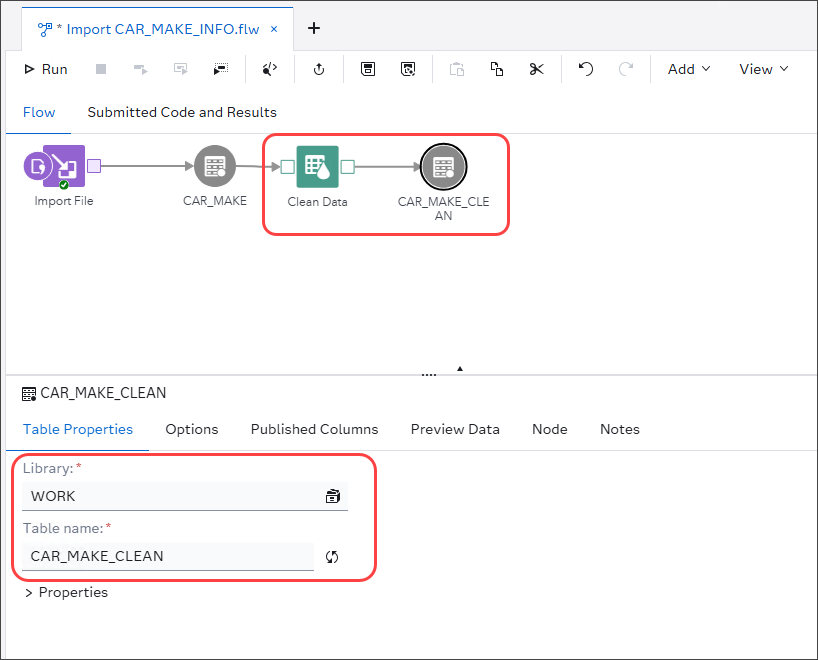

1. Select  to rearrange the nodes in the flow.
1. Select  to save the flow.
1. Select  to run the flow. Review the **Submitted Code and Results &#10132; Output Data** and confirm that **CAR_MAKE_CLEAN** was created with **3** columns and **37** rows.

   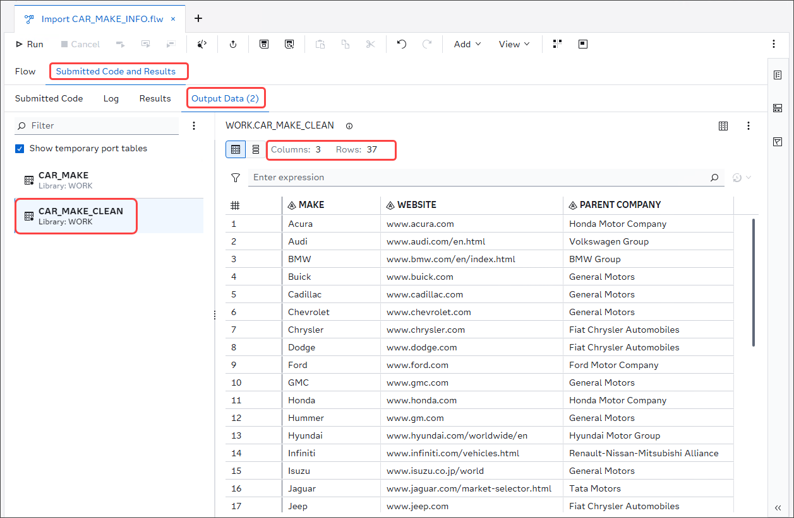

   > &#9998; Note that each **WEBSITE** URL now starts with `www.` and that **PARENT COMPANY** values are now cased consistently.
1. When finished reviewing the results, close **Import CAR_MAKE_INFO.flw**.

## Add a Subflow to an Existing Flow

1. In SAS Studio, select **Options &#10132; Reset SAS Session**.

   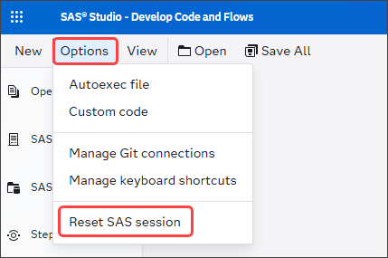

1. Select 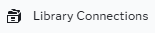 to view the **Library Connections** pane. Select the **WORK** library and confirm that it has no contents.

   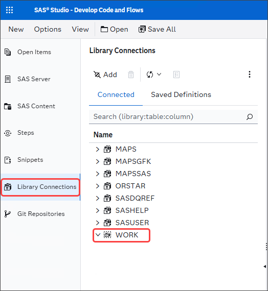

1. Select  to view the **SAS Content** pane.
1. Navigate to **My Folder** and double click **Join Car Data.flw** to open the flow.

   

   > &#9998; This flow joins the **SASHELP.CARS** and **WORK.CAR_MAKE_CLEAN** tables, then extrapolates the joined data to create reports and charts.

1. Select  to run the flow. Review the **Submitted Code and Results** and confirm that the flow fails because **WORK.CAR_MAKE_CLEAN** does not exist.

   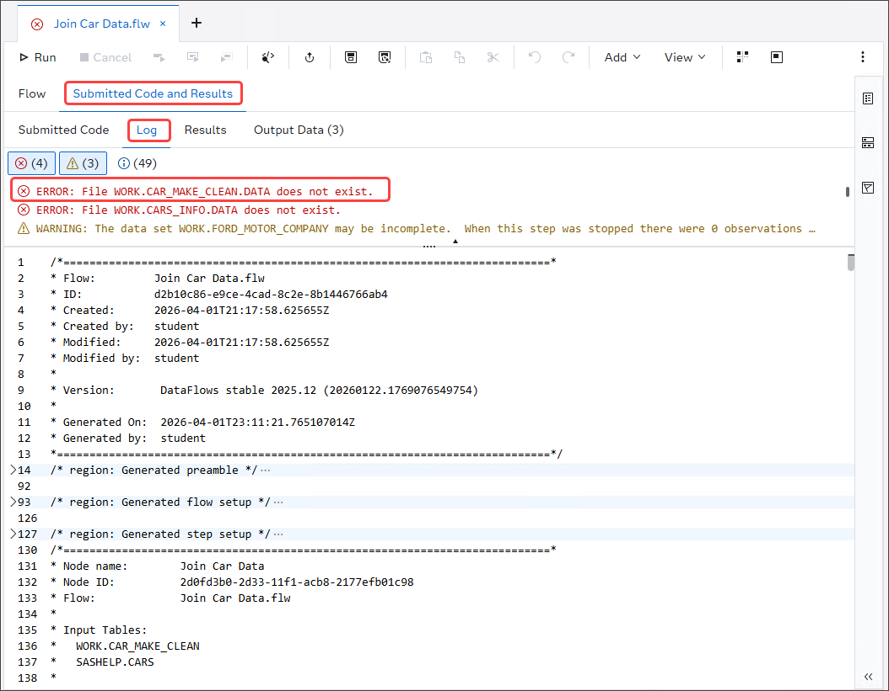

1. Select the **Flow** tab to return to the flow canvas.
1. Select  (on the right side of the flow canvas) to open the *Submission Order* properties pane.
1. The existing swimlane, *Join Car Data*, appears. Select  to add a second swimlane to the flow.
1. Enter **Import CAR_MAKE_INFO** for the name of the new swimlane (replacing the default name, *Swimlane 2*.)
1. With the *Import CAR_MAKE_INFO* swimlane selected, select  to move that swimlane to the top position.

     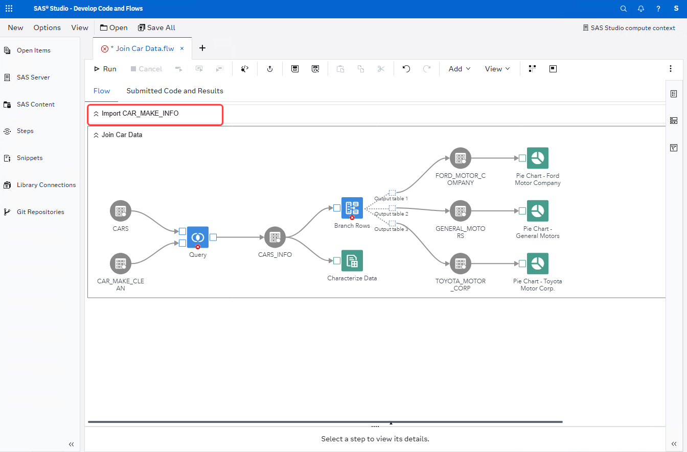

1. Select  to view the **SAS Content** pane.
1. Navigate to **My Folder**. Click and drag **Import CAR_MAKE_INFO.flw** onto the flow canvas *and* in the *Import CAR_MAKE_INFO* swimlane.

   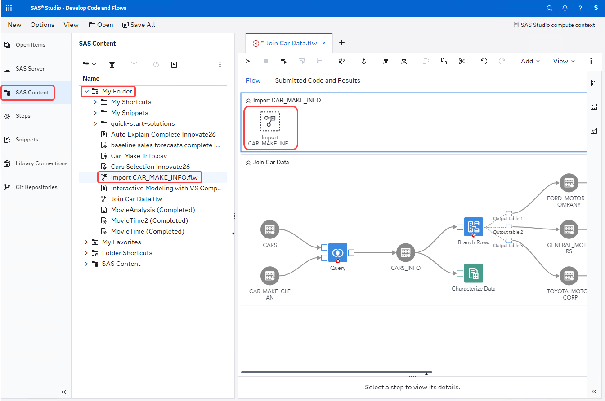

1. Select  to save the flow.
1. Select  to run the flow. The flow now runs successfully.
1. Review the results of each portion of the flow by reviewing the *Output Data* and *Results* on the **Submitted Code and Results** tab.

   * The **Query** step creates the output table **CARS_INFO**, which contains 17 columns and 394 rows.

     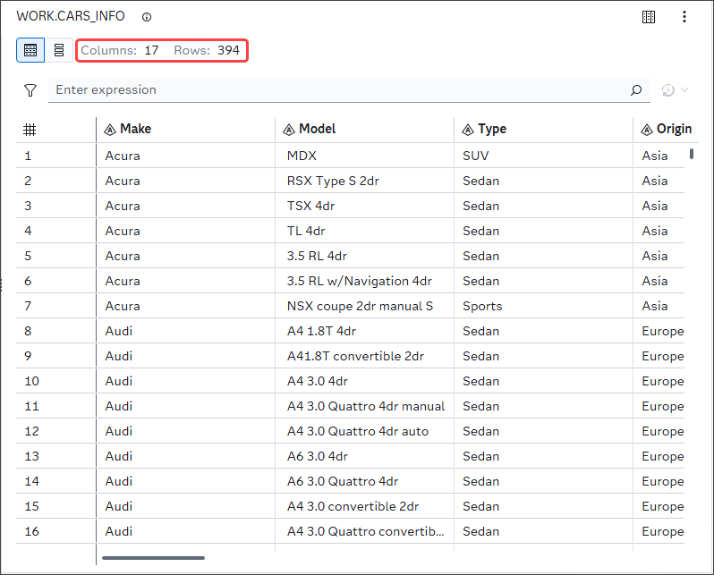

   * The **Characterize Data** step prints a report and a chart on the frequencies of the **PARENT COMPANY** values in **CARS_INFO**. The most frequent value is *General Motors*, followed by *Ford Motor Company*, *Toyota Motor Corporation*, and *Volkswagen Group*.

     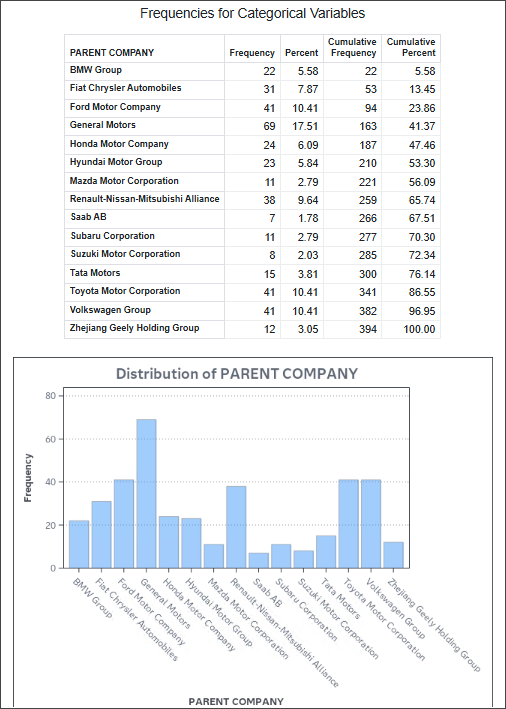

   * The **Branch Rows** node subsets **CARS_INFO** based on *PARENT COMPANY* values and creates three output tables: **FORD_MOTOR_COMPANY**, **GENERAL_MOTORS**, and **TOYOTA MOTOR CORPORATION**.

     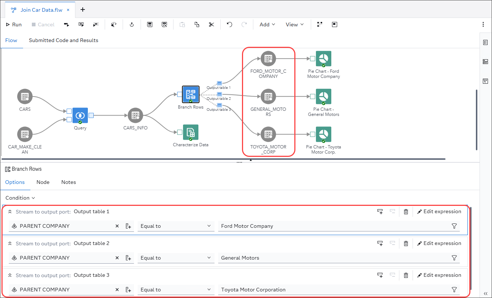

   * The **Pie Chart** nodes create pie charts showing the frequency of vehicle types in each of the subsetted tables.

     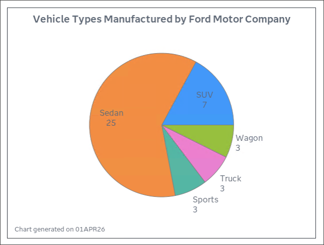

     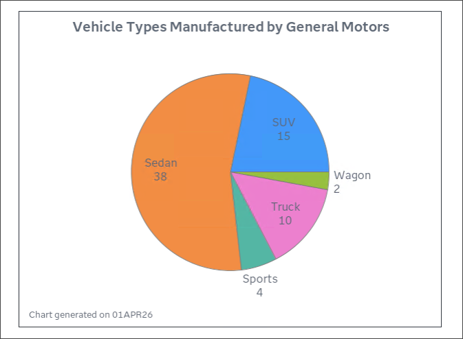

     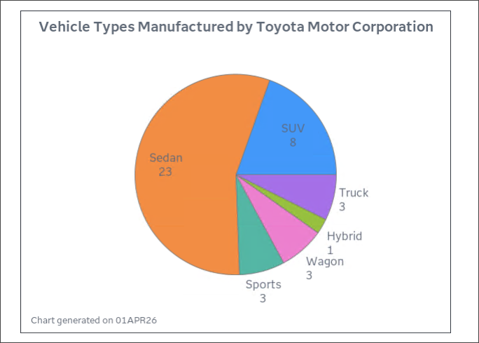

## Exercise Completed

You have completed the exercise for **Subflows in SAS Viya**.

**THANK YOU FOR ATTENDING THIS SESSION!**

**PLEASE COMPLETE THE WORKSHOP EVALUATION!**
